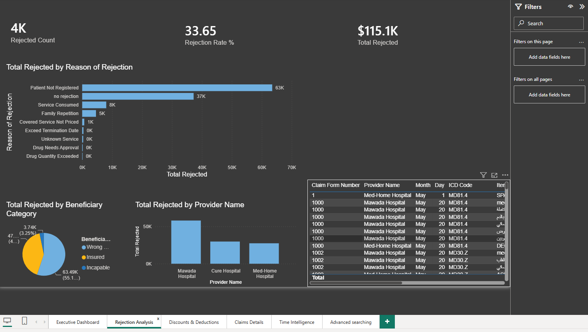
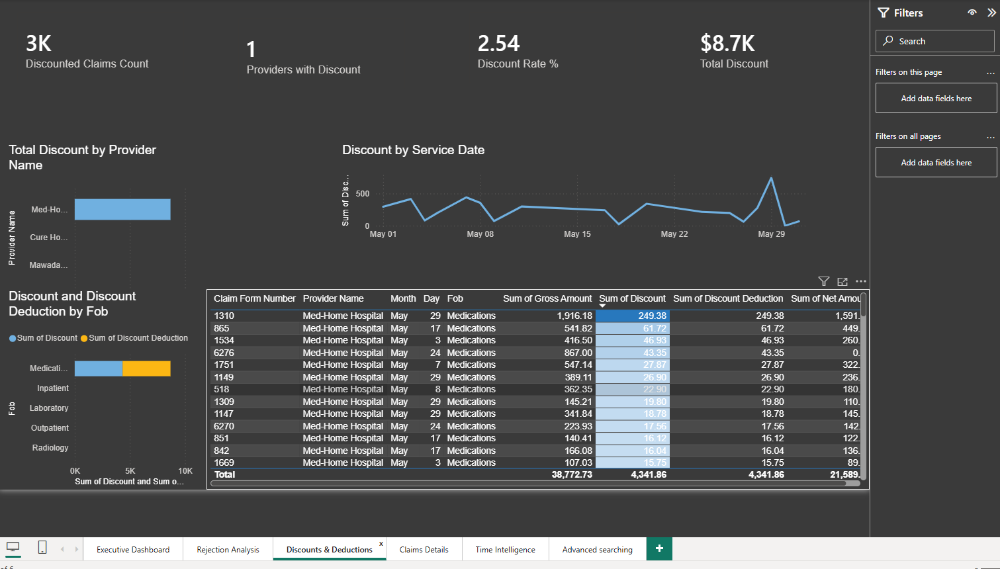
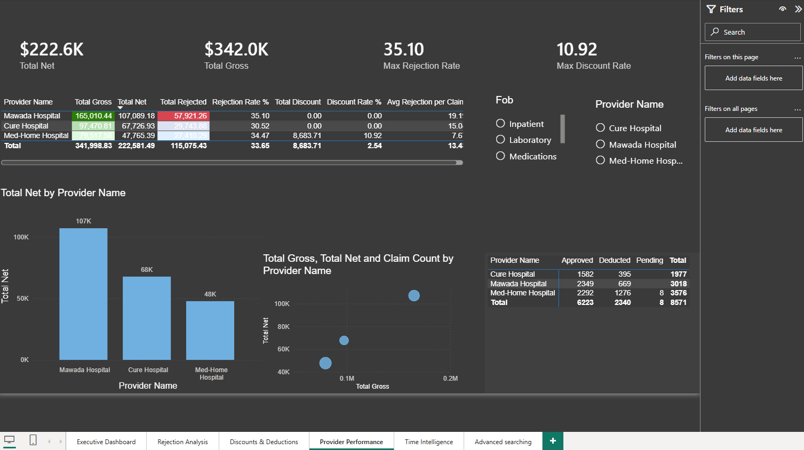
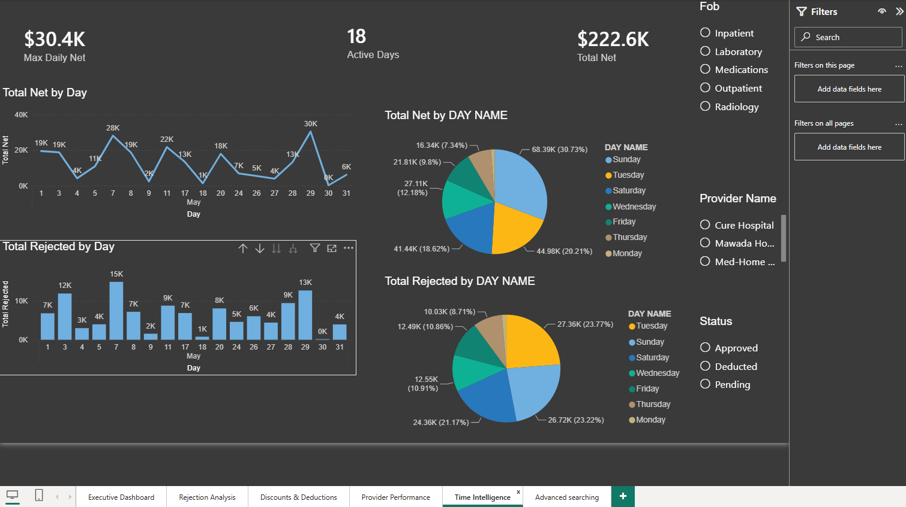
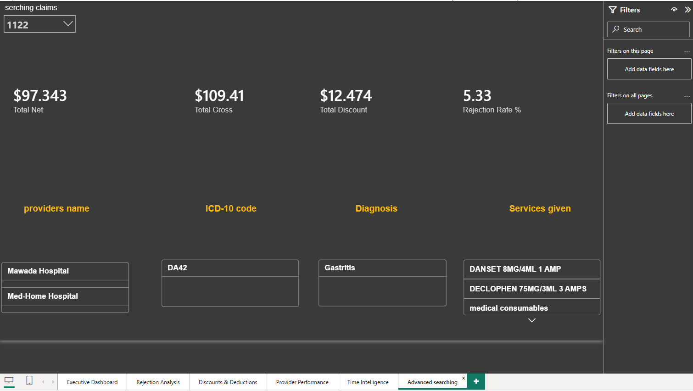

# Claims Performance Dashboard – Power BI Project

**Prepared by:** Muzaffer Kamal  
**Date:** sep 2026  
**Tools:** Power BI Desktop, Power Query, DAX

---

## 📌 Project Overview
This project is an interactive dashboard built to analyze healthcare insurance claims.  
It helps stakeholders monitor financial performance, identify rejection reasons, track discounts, and evaluate provider performance.

---

## 📊 Pages Included

1. **Executive Dashboard** – Key KPIs and high-level metrics.
2. **Rejection Analysis** – Rejection reasons, top providers.
3. **Deductions & Discounts** – Discount distribution by service and provider.
4. **Provider Performance** – Comparative analysis of providers.
5. **Time Intelligence** – Daily and weekly trends.
6. **Advanced Search** – Search claims by Claim Form Number.

---

## 🛠️ Key Skills Demonstrated

- Data Cleaning using Power Query (handling blanks, formatting dates, creating custom columns).
- Data Modeling (relationships, star schema).
- DAX Measures (Total Gross, Net, Rejection Rate, Discount Rate, etc.).
- Interactive Visuals (slicers, drill-through, bookmarks).
- Advanced Search using Text Filter Slicer.

---

## 📈 Key Insights

- Total Rejection Rate: **6.08%**
- Top Rejection Reasons: **"Patient Not Registered"** and **"Drug Quantity Exceeded"**
- Discounts are only applied to **Medication** services.
- Best performing provider: *(mawada-hosptal)*

---

## 📷 Screenshots

### 1. Executive Dashboard

### 2. Rejection Analysis

### 3. Deductions & Discounts

### 4. Provider Performance

### 5. Time Intelligence

### 6. Advanced Search

---

---

## 📁 Project Structure
Claims_Dashboard_Portfolio/
│
├── Claims_Dashboard.pbix
├── README.md
└── Screenshots/
├── 1_Executive_Dashboard.png
├── 2_Rejection_Analysis.png
├── 3_Deductions_Discounts.png
├── 4_Provider_Performance.png
├── 5_Time_Intelligence.png
└── 6_Advanced_Search.png
